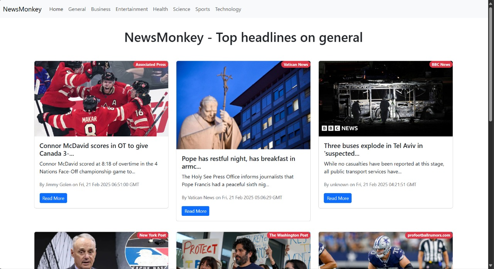

# NewsMonkey - A React News App

NewsMonkey is a news aggregator application built using React that fetches and displays the latest news headlines from various categories using the NewsAPI.

## Features
- Fetches real-time news articles.
- Supports infinite scrolling for a seamless browsing experience.
- Categorized news sections (e.g., Business, Sports, Technology, etc.).
- Displays article titles, descriptions, authors, and published dates.
- Responsive and clean UI using Bootstrap.

## Tech Stack
- **React** - Frontend framework
- **Bootstrap** - Styling and layout
- **NewsAPI** - Fetching real-time news data
- **InfiniteScroll** - Infinite scrolling functionality

## Installation & Setup

### 1️⃣ Clone the Repository
```bash
git clone https://github.com/yourusername/NewsMonkey.git
cd NewsMonkey
```

### 2️⃣ Install Dependencies
```bash
npm install
```

### 3️⃣ Get a NewsAPI Key
- Sign up at [NewsAPI](https://newsapi.org/) and get your API key.

### 4️⃣ Create an `.env.local` File
Inside the project directory, create a `.env.local` file and add your API key:
```
REACT_APP_NEWS_API_KEY=your_api_key_here
```

### 5️⃣ Run the Application
```bash
npm start
```
The app will be available at `http://localhost:3000/`.

## Project Structure
```
NewsMonkey/
│── src/
│   ├── components/
│   │   ├── News.js
│   │   ├── NewsItem.js
│   │   ├── Spinner.js
│   ├── App.js
│   ├── index.js
│── public/
│── package.json
│── README.md
```

## Preview
✨ **NewsMonkey in Action** ✨



## Deployment
You can deploy this React app using:
- **Vercel**: `vercel --prod`
- **Netlify**: Connect GitHub repo & deploy
- **GitHub Pages** (after running `npm run build`)

## Contributing
Pull requests are welcome! If you have suggestions for improvements, feel free to fork the repository and create a PR.

## License
This project is licensed under the MIT License.

---
**Enjoy browsing news with NewsMonkey! 📰🚀**

